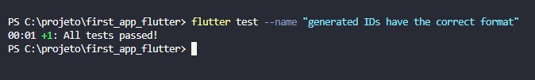
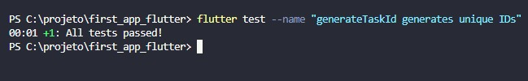
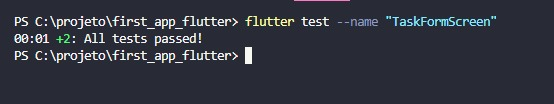
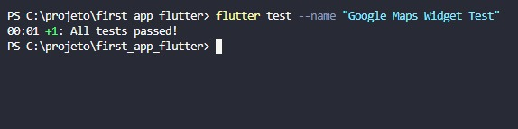

# Task Manager Flutter App

Este é um aplicativo de gerenciamento de tarefas desenvolvido em Flutter.

## Funcionalidades

- Cadastro, edição, exclusão e visualização de tarefas.
- Integração com Google Maps para exibição de localização de tarefas.
- Armazenamento local das tarefas (sem persistência em banco de dados).

## Tecnologias Utilizadas

- Flutter
- Firebase (para autenticação e armazenamento de imagens)
- Google Maps API
- Provider (para gerenciamento de estado)

## Configuração do Ambiente de Desenvolvimento

Certifique-se de ter Flutter instalado. Para mais detalhes, consulte https://flutter.dev/docs/get-started/install.

## Instalação

Clone o repositório e instale as dependências:

```sh
    git clone https://github.com/seu-usuario/task_manager_flutter.git
    cd task_manager_flutter
    flutter pub get

## Como Executar

### Emulador

1. Abra seu emulador Android/iOS.
2. Execute o seguinte comando no terminal:
    flutter run

## Dispositivo Físico

1. Conecte seu dispositivo Android/iOS via USB.
2. Verifique se o dispositivo está visível para o Flutter:
    flutter devices

3. Execute o aplicativo no dispositivo:
    flutter run -d dispositivo-id

## Gerenciamento de Estado

Utilizei o Provider para gerenciar o estado do aplicativo de forma eficiente e escalável.

## Navegação

A navegação entre telas é realizada através do uso de rotas nomeadas, facilitando a gestão das transições entre diferentes partes do aplicativo.

## Testes Implementados


Para executar teste unitários:

    flutter test

Teste para ver se os IDs gerados têm o formato correto.

    flutter test --name "generated IDs have the correct format"



Testa para verificar se o método generateTaskId gera IDs únicos. 

    flutter test --name "generateTaskId generates unique IDs"



Teste para validação de nome não vazio.

    flutter test --name "Non-empty name validation"


Teste para comportamento geral da tela de formulário de tarefas.

    flutter test --name "TaskFormScreen"



Teste de widget do Google Maps para garantir seu correto funcionamento.

    flutter test --name "Google Maps Widget Test"



## API Externa

O aplicativo consome a API de Geocoding do Google Maps para converter endereços em coordenadas geográficas.

## Pacote Desenvolvido

Desenvolvi um pacote para integração simplificada com a API de Geocoding. Para utilizá-lo:

1. Instale o pacote via pubspec.yaml:
    dependencies:
    oogle_maps_geocoding: ^1.0.0
2. Importe e utilize conforme documentação do pacote..

## Capturas de Tela


## Contribuição

Contribuições são bem-vindas! Para grandes alterações, por favor, abra uma issue para discutir o que você gostaria de mudar.